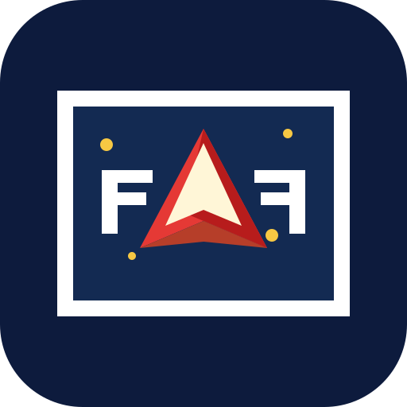

<p align="center">
  
</p>

<h1 align="center">Flash Exterminator</h1>

<p align="center">
  Um jogo espacial clássico de 2016, preservado para a web moderna.
</p>

<p align="center">
  <a href="https://developer.mozilla.org/docs/Web/HTML"></a>
  <a href="https://developer.mozilla.org/docs/Web/CSS"></a>
  <a href="https://developer.mozilla.org/docs/Web/JavaScript"></a>
  
  <a href="https://ruffle.rs/"></a>
  <a href="https://web.dev/progressive-web-apps/"></a>
</p>

<p align="center">
  <a href="https://alanliveira.github.io/flash-exterminator/"><strong>Jogar agora</strong></a>
</p>

## Sobre

**Flash Exterminator** é um jogo espacial desenvolvido originalmente em Adobe Flash/ActionScript para a disciplina de Desenvolvimento de Jogos para Web I, do curso técnico em Jogos Digitais (2016). Nesta versão, o arquivo SWF é executado diretamente no navegador pelo emulador [Ruffle](https://ruffle.rs/).

Além do modo padrão, a interface oferece um modo **Game Boy** em tela cheia e pode ser instalada como aplicativo graças ao suporte a PWA.

## Como jogar

- Use as setas direcionais para mover a nave.
- Pressione <kbd>Espaço</kbd> para atirar.
- Clique uma vez dentro da tela do jogo para ativar o áudio e direcionar os controles ao jogo.
- Em dispositivos móveis, abra o modo **Game Boy** para usar os controles na tela.

## Executar localmente

O projeto não requer instalação de dependências. Como utiliza service worker, sirva os arquivos por um servidor HTTP local — não abra o `index.html` diretamente pelo sistema de arquivos.

```bash
npx serve .
```

Depois, abra o endereço informado pelo comando no navegador.

## Tecnologias

- **HTML5, CSS3 e JavaScript** para a interface responsiva e os controles.
- **Adobe Flash / ActionScript** para o jogo original.
- **Ruffle** para executar o conteúdo SWF em navegadores atuais.
- **Web App Manifest e Service Worker** para instalação e cache offline do aplicativo.

## Estrutura

```text
.
├── index.html              # Interface e integração com Ruffle
├── manifest.webmanifest    # Configuração do PWA
├── service-worker.js        # Cache do aplicativo
└── assets/                 # Jogo SWF, áudio, imagens e ícone
```
